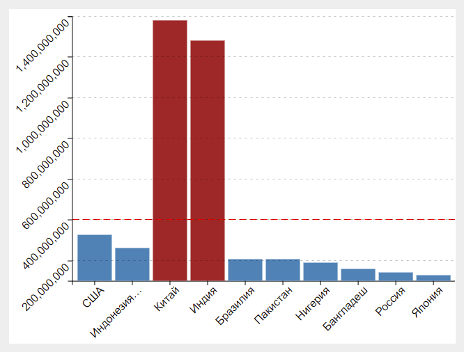

# Hello D3.js project on typescript.



## Building
This project has been created using **webpack-cli**, you can now run

```
npm run build
```

or

```
yarn build
```

to bundle your application

## Developing
For dedevoping run:
```
npm run watch
```
and open in browser `.\dist\index.html`,
or run:
```
npm run serve
```
and open [](http://localhost:8080/)
